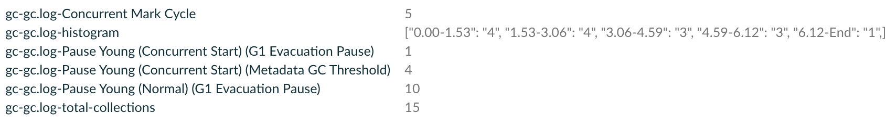

## GC Report Plugin
Gradle plugin that collects GC metrics based on the GC logs generated during the build.
If [Develocity](https://gradle.com/develocity/) is configured in the project, the plugin publishes GC metrics as custom values. Otherwise, it generates a console report and a CSV file.

Analyzing the types of garbage collections that occurred during the build can provide valuable insights into performance issues.

**This plugin is intended for performance investigations and is not meant to be enabled in regular builds.**
### Usage
#### Apply the plugin
```kotlin
plugins {
  id("io.github.cdsap.gc-report") version "0.1.0"
}
```
#### Configure JVM properties with the daemon log
```properties
org.gradle.jvmargs=-Xlog:gc*:file=/project/gradle_gc.log
```

#### Configure the extension

```kotlin
gcReport {
    logs = listOf("gradle_gc.log")
}

```

#### Configuring GC Logs for Multiple Processes
If your project involves multiple JVM processes, such as Gradle and Kotlin, you can configure the plugin to collect GC metrics from all of them by specifying multiple log files.

For example, to capture GC logs from both Gradle and Kotlin daemon processes, configure their JVM arguments as follows:
```
org.gradle.jvmargs=-Xlog:gc*:file=/project/gradle_gc.log
kotlin.daemon.jvmargs=-Xlog:gc*:file=/project/kotlin_gc.log
```
Then, update the plugin configuration to process both logs:
```kotlin
gcReport {
    logs = listOf("gradle_gc.log","kotlin_gc.log")
}
```
This ensures that GC metrics from both the Gradle build process and the Kotlin daemon are captured and analyzed.
#### Output
##### Develocity

##### Console Output
```
┌──────────────────────────────────────────────────────────────────────┐
│ GC Log: gc.log                                                       │
├────────────────────────────────────────────────────────┬─────────────┤
│ Collection type                                        │ Occurrences │
├────────────────────────────────────────────────────────┼─────────────┤
│ Pause Young (Normal) (G1 Evacuation Pause)             │           6 │
├────────────────────────────────────────────────────────┼─────────────┤
│ Pause Young (Concurrent Start) (Metadata GC Threshold) │           4 │
├────────────────────────────────────────────────────────┼─────────────┤
│ Pause Young (Prepare Mixed) (G1 Evacuation Pause)      │           3 │
├────────────────────────────────────────────────────────┼─────────────┤
│ Pause Young (Mixed) (G1 Evacuation Pause)              │           3 │
├────────────────────────────────────────────────────────┼─────────────┤
│ Concurrent Mark Cycle                                  │           4 │
└────────────────────────────────────────────────────────┴─────────────┘
```
##### CSV File Output
```
Collection type,Occurrences
Pause Young (Normal) (G1 Evacuation Pause),8
Pause Young (Concurrent Start) (Metadata GC Threshold),4
Pause Young (Prepare Mixed) (G1 Evacuation Pause),1
Pause Young (Mixed) (G1 Evacuation Pause),1
Concurrent Mark Cycle,4
```


#### Configuring Histograms
The plugin can generate histograms from the GC log data. This is useful for visualizing the distribution of GC events over time.
You can configure the histograms by setting the `histogram` property in the `gcReport` extension:
```kotlin
gcReport {
   logs.set(listOf("$gcLog"))
   histogramEnabled.set(true)
   histogramBucket.set(Bucket.SquareRoot)
}
```
There are three bucket types available:
* `Bucket.SquareRoot` - Uses the square root of the number of elements to determine the number of bins, often used for small datasets.
* `Bucket.Sturges` - Uses Sturges' formula, which works well for normally distributed data.
* `Bucket.FreedmanDiaconis` - Adapts the bin width based on data variability, useful for datasets with high variance.

When enabling this option, the plugin will generate a histogram entry in Develocity as a custom value or a new CSV file:
```
Bucket,Occurrences
0.00-1.23,4
1.23-2.46,3
2.46-3.69,4
3.69-4.92,3
4.92-End,1
```

### Considerations
* Supported GC types:
    - G1
    - Parallel
* The plugin output may be unreliable for incremental builds where log rotations have occurred.


